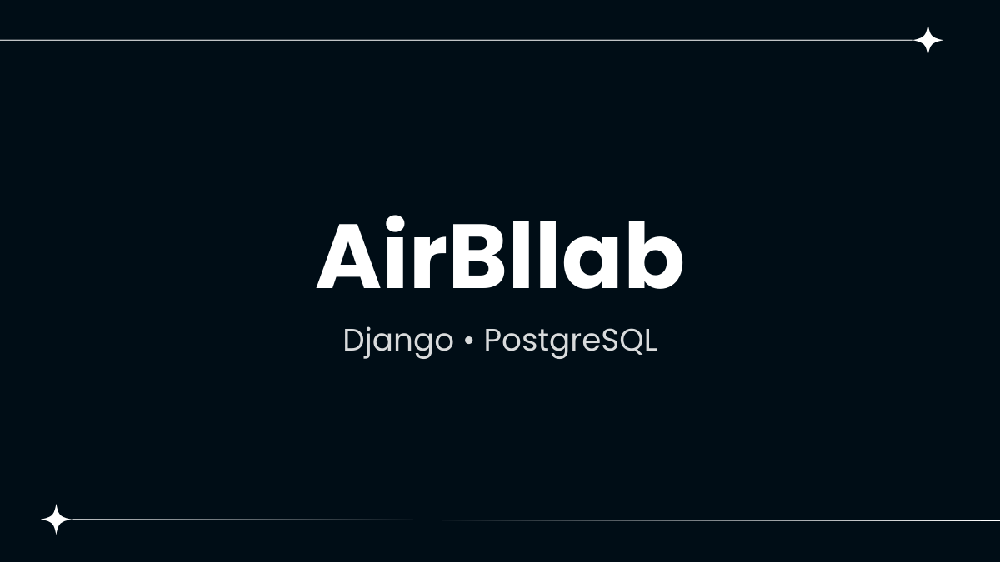
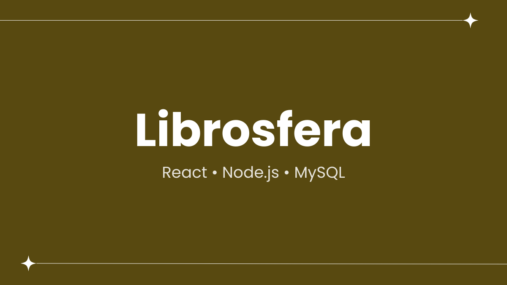
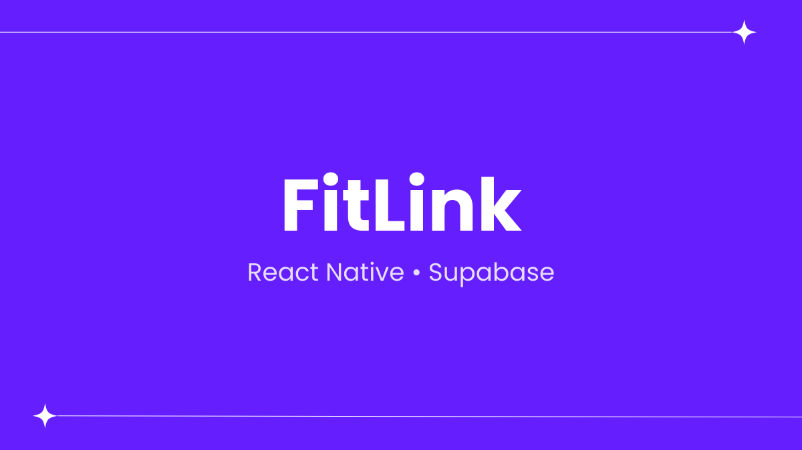

<h1 align="center">Hi, I'm Erick Hernández👋</h1>

Connect with me on [LinkedIn](https://www.linkedin.com/in/erick-hernández-ucr)

## About me

- 🎓 Computer Science student with a Software Engineering focus at the University of Costa Rica.
- 💻 Interested in software development, including web applications and backend systems.
- ⚛️ Experience with React, Node.js, Python, C++, and SQL through academic projects.
- 🛠️ Familiar with Agile/Scrum methodologies and version control using Git & GitHub.
- 🚀 Actively seeking internship opportunities to gain professional experience and grow as a software engineer.

## Projects

<table>
  <tr>
    <td width="50%" valign="top">
      <h3 align="center">AirBllab</h3>
      

        
        

          
        

        
Developed a web application inspired by Airbnb that allows users to explore accommodations, services, and experiences, and complete bookings through a full reservation flow, including adding items to the shopping cart and making payments. I contributed to both frontend and backend development using Django, as well as the design and implementation of the relational database using PostgreSQL.

      

    </td>
    <td width="50%" valign="top">
      <h3 align="center">Librosfera</h3>
      

        
        

          
        

        
Developed a web application for selling books online. Actively contributed to the design and implementation of the database using MySQL, and participated in the development of both the frontend, built with React, and the backend, implemented with Node.js. The platform enables users to browse and purchase books efficiently, providing a seamless shopping experience.

      

    </td>
  </tr>
</table>

 

<table>
  <tr>
    <td width="50%" valign="top">
      <h3 align="center">FitLink</h3>
      

        
        

          
        

        
Developed a mobile application designed for gym users that allows them to create and store workout routines, as well as track their workouts. The app lets users log exercises, sets, and reps, providing a detailed workout history. I actively contributed to the development of the mobile interface using React Native with Expo and to the integration of the backend using Supabase for authentication and data persistence.

      

    </td>
    <td width="50%" valign="top">
      <h3 align="center">EventMaker</h3>
      

        
        

          
        

        
Developed a web application that enables users to reserve rooms for a specific time, specifying the date and type of event, with the option to add additional services. The system also allows administrative staff to manage resources and availability efficiently. Actively collaborated in the design and implementation of the database and contributed to the development of both the frontend, built with React, and the backend, including a RESTful API implemented with Node.js and connected to an Oracle Cloud database.

      

    </td>
  </tr>
</table>
 
