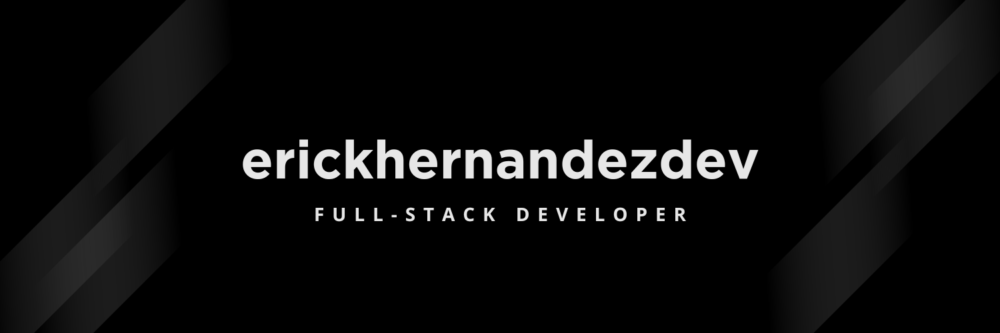
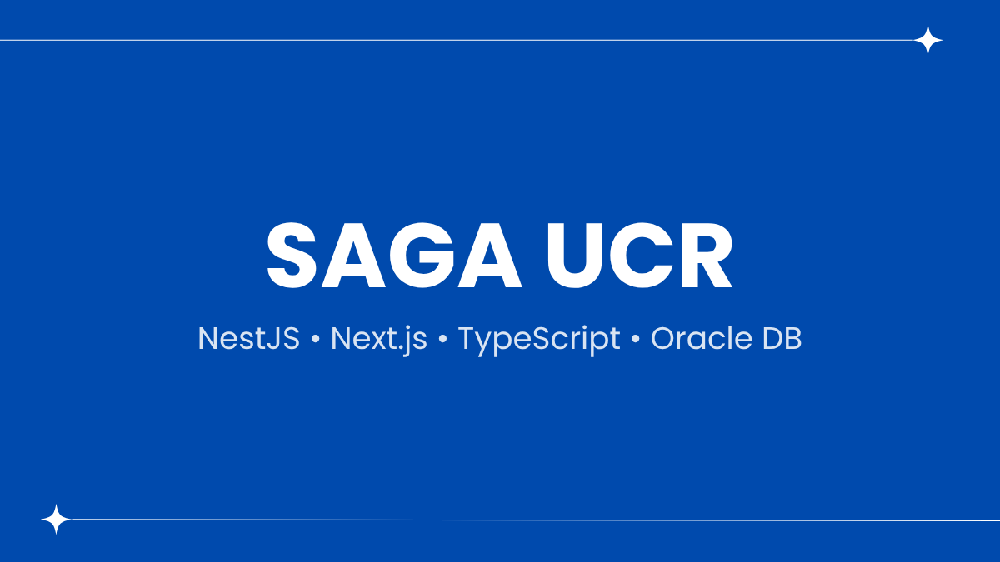
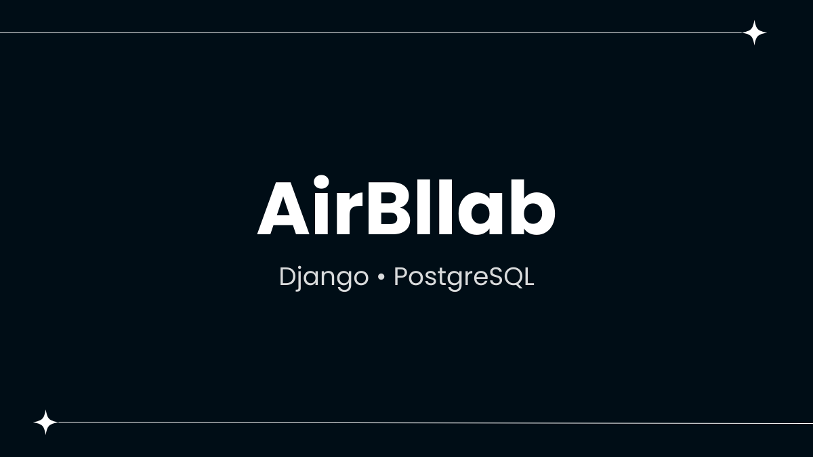
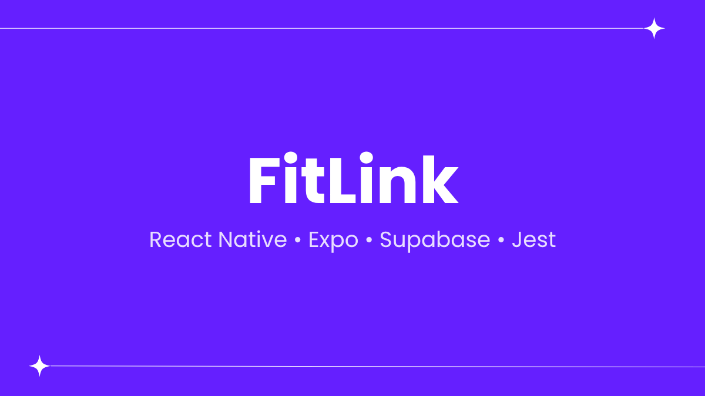
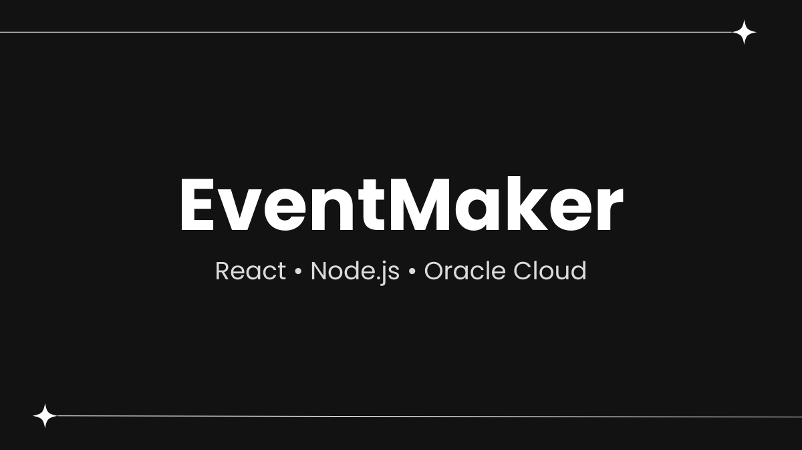
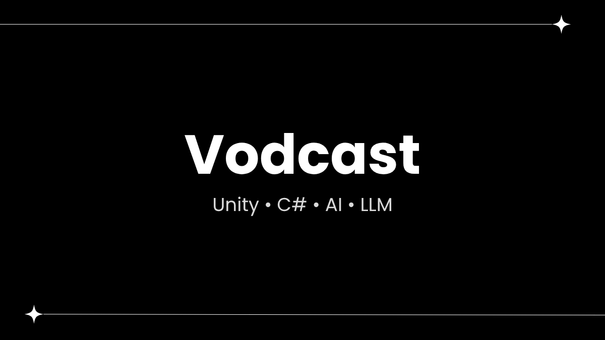
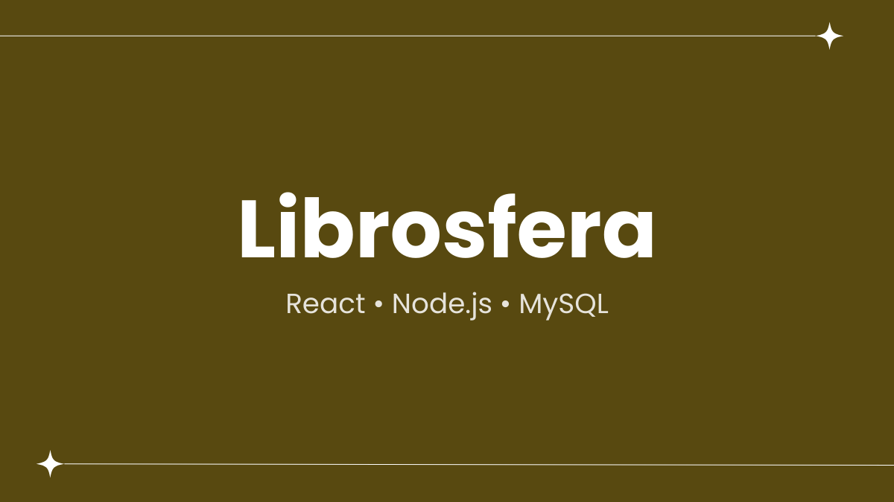

  <h1>Hi, I'm Erick Hernández 👋</h1>
  
  

    <b>Computer Science Engineer · Software Engineering Track · University of Costa Rica</b> 
    Graduated Cum Laude · Seeking first professional role in software development
  

  
  &nbsp;
  

---

## About Me

- Recently graduated in Computer Science with a Software Engineering track at the University of Costa Rica, Cum Laude.
- 20 months of real-world experience as a Web Developer and QA Assistant at UCR departments (DIMA & DEDUN).
- Built full-stack web and mobile applications across real-world and academic projects using modern technologies.
- Known for being a collaborative team player with strong communication skills and a genuine focus on team dynamics.
- Committed to continuous learning and delivering clean, maintainable, and reliable software.
- Based in San José, Costa Rica · Open to local and remote opportunities.

---

## Tech Stack

**Frontend**

**Backend**

**Databases & Cloud**

**Tools & Methods**

---

## Experience

**Web Developer Assistant · DIMA, University of Costa Rica** *(Aug 2025 – Jul 2026)*
> Designed and developed a new institutional website in Drupal, eliminating over 300 student email inquiries through a self-service exam scheduling feature.

**QA Assistant · DEDUN, University of Costa Rica** *(Mar 2026 – Jul 2026)*
> Identified 14 defects across 35 manual test cases for a faculty enrollment workflow, delivering a comprehensive QA report with documented evidence.

---

## Projects

<table>
  <tr>
    <td width="50%" valign="top">
      

        
        
Contributed to centralizing UCR's scientific production repositories into a unified platform. Delivered the full-stack Units module with 10+ REST API endpoints, filtering, pagination, and data export. Achieved ~90% unit test coverage across a 21-person engineering team.

        
<i>Private repository — institutional project of the University of Costa Rica.</i>

      

    </td>
    <td width="50%" valign="top">
      

        
        
Full-stack accommodation booking platform with 4+ end-to-end user flows, enterprise-grade security including YubiKey-based two-factor authentication, and deployed on a production server.

        

          
        

      

    </td>
  </tr>
  <tr>
    <td width="50%" valign="top">
      

       
        
        
Cross-platform mobile app for iOS and Android covering workout logging, history, progress tracking, and custom routines across 10+ screens. Achieved ~90% test coverage with Jest and React Testing Library.

        

          
        

      

    </td>
    <td width="50%" valign="top">
      

       
        
        
Full-stack event reservation system enabling concurrent bookings through a RESTful API with 20+ endpoints and a relational database of 10+ tables on Oracle Cloud Infrastructure.

        

          
        

      

    </td>
  </tr>
  <tr>
    <td width="50%" valign="top">
      

       
        
        
AI-powered virtual agent with a 3-stage conversational pipeline: Speech-to-Text, Gemini LLM response generation, and Text-to-Speech. Reduced end-to-end response time by 50% through asynchronous optimization.

        

          
        

      

    </td>
    <td width="50%" valign="top">
      

       
        
        
Full-stack e-commerce platform for books with complete purchase flow across 4 stages: search, filtering, cart, and payment, supporting a catalog of 30+ products with responsive UI.

        

          
        

      

    </td>
  </tr>
</table>

---

  
Feel free to reach out. Always open to new opportunities and collaborations.

